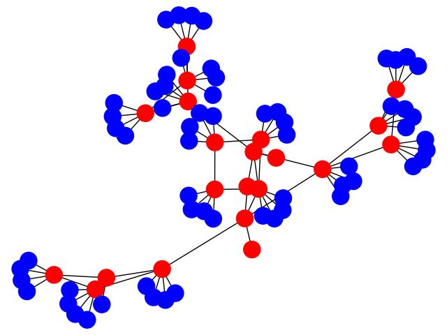

# 5gslicing

Example usage:

```
> import network_generator
> nwkgen = network_generator.NetworkGenerator(50)
```

The parameter to ``NetworkGenerator`` is the size (in kms) of
the deployment area.

```
> nwkgen.generate_demographic((25,25), 5)
```

This adds a population of UEs distributed following a 2D Gaussian distribution
centered at (25,25) kms, with a standard deviation of 5kms.

```
> infra = nwkgen.generate_5g_infra(1)
```

This generates the 5G infrastructure to support the population of UEs created
previously. The argument provided is a random seed.

```
> g = infra.generate_nx_graph()
```

``g`` contains two types of nodes:

* _computational_ nodes provide the following attributes:
    * 'type' is 'pop' (point of presence)
    * 'cores': number of processing cores
    * 'storage': TB of storage
    * 'gpus': number of gpus for cloud gaming (or other apps)
    * 'traffic': input rate into the node.
* _access points_ with the following attributes:
    * 'type' is 'sap'
    * 'tas': a list of Tracking Areas aggregated into this AP
    * 'traffic': (input rate, output rate).

The edges of the graph represent communication links with the following attributes:

* 'capacity' in Mbps of the link
* 'latency' of the link (just the transport, does not consider queues at the
two endpoints of the link).

The figure below shows a sample of an infrastructure graph.
The red nodes are PoPs, the blue are SAPs.


